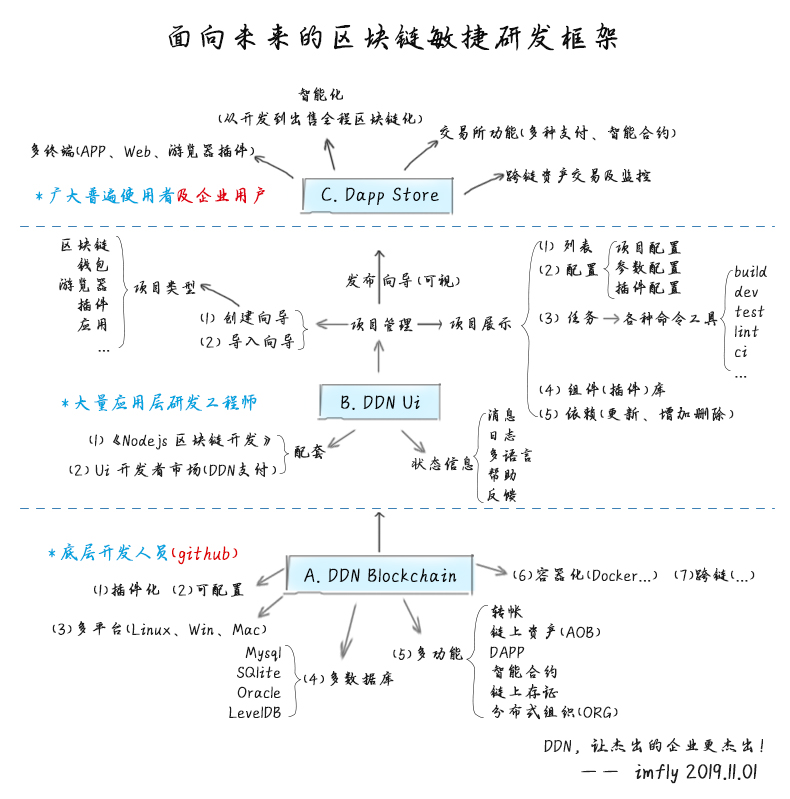

<h1 align="center">
  
   
  数据分发网络
   
  新一代区块链系统
   
</h1>

  
  
  
  
  

  <a href="/README.md">English</a> •
  <a href="/README-zh-CN.md">简体中文 (Simplified Chinese)</a> •

**基于当前版本的测试链**: <http://testnet.ddn.link>

DDN, 是一个成熟的企业级区块链系统，已经服务于版权存证、检验检测、电子医疗等10多个领域。

更多信息，请查看 [官网](https://www.ddn.link) , [docs](http://docs.ddn.link).

**配套书籍和视频**: [《Nodejs区块链开发2》](https://github.com/imfly/blockchain-on-nodejs), [旧版电子书](https://github.com/imfly/bitcoin-on-nodejs), [旧版纸质书籍](https://item.jd.com/12206128.html), [旧版代码](https://github.com/ebookcoin/ebookcoin)

测试网络：<http://testnet.ddn.link>

> 特别注意：> 3.* 的版本并未兼容当前主网，切记不要使用主网测试你的Dapp应用。

## 特点

- [x] **成熟**, 已经服务于多个企业级区块链系统;
- [x] **文档齐全**, 简单、快速、门槛低，开发前请参考书籍[《Nodejs区块链开发》](https://github.com/imfly/bitcoin-on-nodejs);
- [x] **可配置**, 你可以通过参数配置自己的节点数量、token名称等;
- [x] **插件化**, 良好的扩展性，可以让你快速开发实现你自己的需求;
- [x] **多平台**, 你可以在Linux、Win或Mac平台上进行开发部署，不过还是建议使用Linux系统;
- [x] **多数据库**, 你可以使用Mysql, SQLite, Oracle, 等主流数据库系统;
- [x] **多功能**, 支付转账、数据存证、链上资产（AoB）、去中心化应用（DAPP）等强大功能;
- [x] **多行业**, 当前已经覆盖版权保护、电子医疗、食品安全、防伪溯源等众多领域;
- [ ] **可视化**, 你可以通过点点鼠标定制自己的区块链并部署到节点服务器上去;
- [ ] **Docker化**, 支持docker、云部署等更多主流部署方式;
- [ ] 更多功能，持续开发中...

## 架构

## 案例

- [DDN 主网](http://mainnet.ddn.link)
- [DDN 钱包](http://wallet.ddn.link)
- [DDN手机钱包](https://www.ddn.link/product/wallet)

## 社区

| Github Issue | DATM |
| ------------------------------------------------------- | ------------------------------------------------------------------------------------------- |
| [ddnlink/ddn/issues](https://github.com/ddnlink/ddn/issues) | | 

> PS：DATM 是基于DDN区块链的 分布式任务管理工具，大家可以在上面领取任务、讨论问题，任务完成，系统通过`智能合约`支付给你DDN

## 贡献

请参考 [贡献文档](./doc/guide/contributing.md) 

## 捐赠

你可以通过[DDN钱包](http://wallet.ddn.link)或者[DDN手机钱包](https://www.ddn.link/product/wallet)向下面的地址捐赠`DDN`，这些DDN将被用于奖励本项目的贡献者.

| DDN基金会钱包转账地址 | DDN手机钱包扫码转账 |
| ------------------------------------------------------- | ------------------------------------------------------------------------------------------- |
| DLjrrVwnmMXstcAYVjcrpwyYb3kY1ehABU | | 

## 协议

The MIT License (MIT)

版权 (c) 2016-2020 DDN基金会。权限受保护。请查看授权文件License.txt获取更多授权信息。
