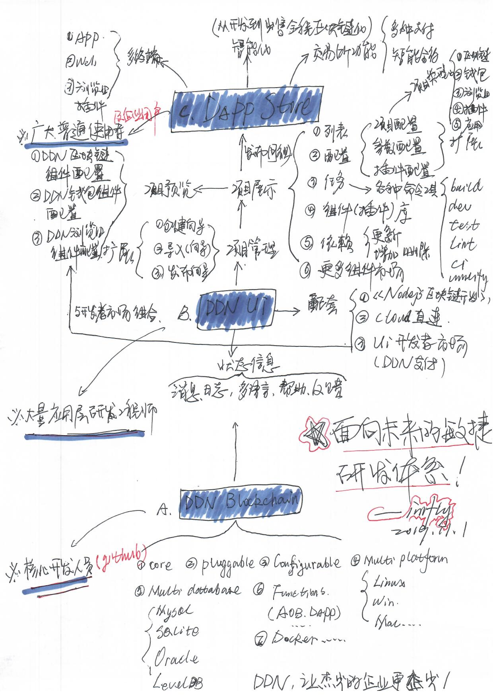

[中文版](./README-zh-CN.md) | [English](./README.md)

# DDN

DDN, Data Delivery Network, is next generation blockchain system.

More infomation please visit our [official website](https://www.ddn.link) , [ddn-docs](https://github.com/ddnlink/ddn-docs) or [“nodejs on blockchain"](https://github.com/imfly/bitcoin-on-nodejs) . The old code is [here](https://github.com/ebookcoin/ebookcoin)

## Architect

## Features

- [x] **Mature**, has successfully served multiple enterprise level products;
- [x] **Complete tutorials**, Simple, fast and low threshold for development, please refer to learn the book [“nodejs on blockchain"](https://github.com/imfly/bitcoin-on-nodejs) before development;
- [x] **Configurable**, you can use your own peer quantity, token name, etc;
- [x] **Pluggable**, good scalability can help you quickly requirement your requirement;
- [x] **Multi platforms**, you can use DDN in Linux, Win, and Mac;
- [x] **Multi databases**, you can use Mysql, SQLite, Oracle, etc;
- [x] **Multi function**, payment, certificate storage, AOB, DAPP, etc;
- [x] **Multi industry**, currently covering copyright protection, electronic medicine, food safety, anti-counterfeiting traceability and other fields
- [ ] **Visual deployment**, you can customize your own blockchain by clicking the mouse and publish it to the peer server;
- [ ] **Docker**, tod support mainstream deployment methods such as docker;
- [ ] More...

## Projects

- [ddn-docs](https://github.com/ddnlink/ddn-docs)
- [ddn-cli](https://github.com/ddnlink/ddn-cli)
- [ddn-aob](./packages/ddn-aob)
- [ddn-evidence](./packages/ddn-evidence)
- [ddn-dapp](./packages/ddn-dapp)
- [ddn-dao](./packages/ddn-dao)
- [ddn-node-sdk](./packages/ddn-node-sdk)
- [ddn-explorer] website: [ddn.link](http://mainnet.ddn.link)

## License

The MIT License (MIT)

Copyright (c) 2016-2019 DDN.link. All rights reserved. See License.txt in the project root for license information.
