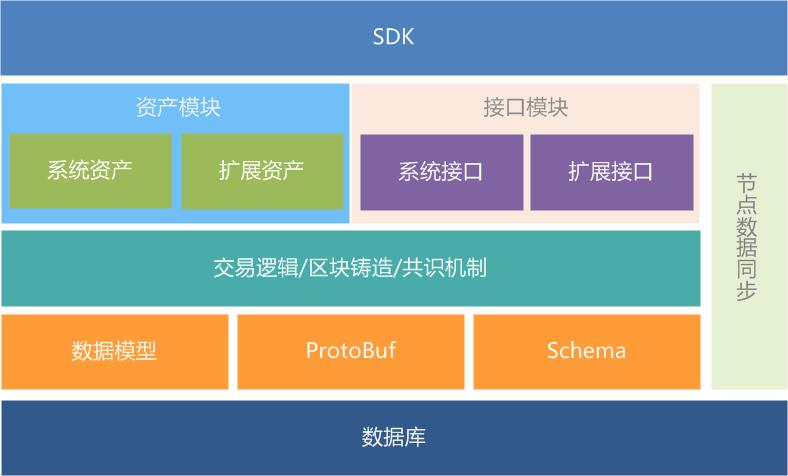
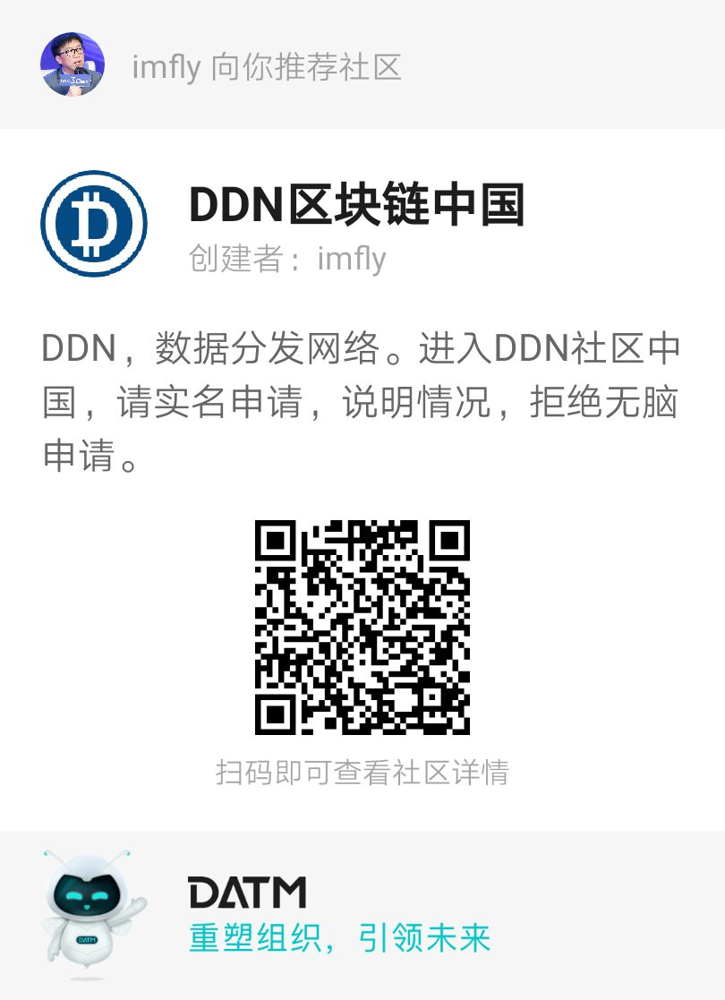
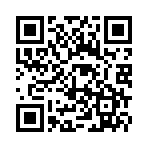

<h1 align="center">
  
   
  Data Delivery Network
   
  A next generation blockchain system
   
</h1>

  
  
  
  
  

  <a href="/README.md">English</a> •
  <a href="/README-zh-CN.md">简体中文 (Simplified Chinese)</a> •

<!-- **Testnet Powered by Current version**: <http://testnet.ddn.link> -->

More infomation please visit our [official website](https://www.ddn.link) , [docs](http://docs.ddn.link).

**Professional books and videos**：[nodejs on blockchain 2](https://github.com/imfly/blockchain-on-nodejs), and [The old book](https://github.com/imfly/bitcoin-on-nodejs), [The old paper book](https://item.jd.com/12206128.html), [The old code](https://github.com/ebookcoin/ebookcoin)

> **Special note**: The 3.* versions are not compatible with the [mainnet](http://mainnet.ddn.link). Do not use the mainnet to test your Dapps.

## Features

- [x] **Mature**, has successfully served multiple enterprise level products;
- [x] **Complete tutorials**, Simple, fast and low threshold for development, please refer to learn the book [nodejs on blockchain 2](https://github.com/imfly/blockchain-on-nodejs) before development;
- [x] **Configurable**, you can use your own peer quantity, token name, etc;
- [x] **Pluggable**, good scalability can help you quickly requirement your requirement;
- [x] **Multi platforms**, you can use DDN in Linux, Win, and Mac;
- [x] **Multi databases**, you can use Mysql, SQLite, Oracle, etc;
- [x] **Multi function**, payment, certificate storage, AOB, DAPP, etc;
- [x] **Multi industry**, currently covering copyright protection, electronic medicine, food safety, anti-counterfeiting traceability and other fields
- [ ] **Visual deployment**, you can customize your own blockchain by clicking the mouse and publish it to the peer server;
- [ ] **Docker**, tod support mainstream deployment methods such as docker;
- [ ] More...

## Architect

## Future

## Examples

- [DDN Site](https://ddn.link)
- [DDN Mainnet](http://mainnet.ddn.link)
- [DDN Testnet](http://mainnet.ddn.link)
- [DDN Wallet](http://wallet.ddn.link)
- [DDN Mobile Wallet](https://www.ddn.link/product/wallet)

## Community

| Github Issue | DATM |
| ------------------------------------------------------- | ------------------------------------------------------------------------------------------- |
| [ddnlink/ddn/issues](https://github.com/ddnlink/ddn/issues) | |

> PS：DATM is a distributed task management tool based on DDN blockchain. You can get tasks and discuss problems. When you complete tasks, The system will pay you DDN through the smart contract.

## Donation

You can donate DDN to the follow address with [DDN Wallet](http://wallet.ddn.link), or [DDN Mobile Wallet](https://www.ddn.link/product/wallet), and these DDN will be paid to those who contribute to this project.

| DDN FOUNDATION Wallet Address | DDN Mobile Wallet QRCode |
| ------------------------------------------------------- | ------------------------------------------------------------------------------------------- |
| DLjrrVwnmMXstcAYVjcrpwyYb3kY1ehABU |  |

## Contribute

Please visit [CONTRIBUTING](./docs/guide/contributing.md)

## License

The MIT License (MIT)

Copyright (c) 2016-2020 DDN FOUNDATION. All rights reserved. See License.txt in the project root for license information.
