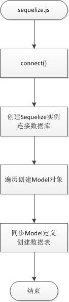
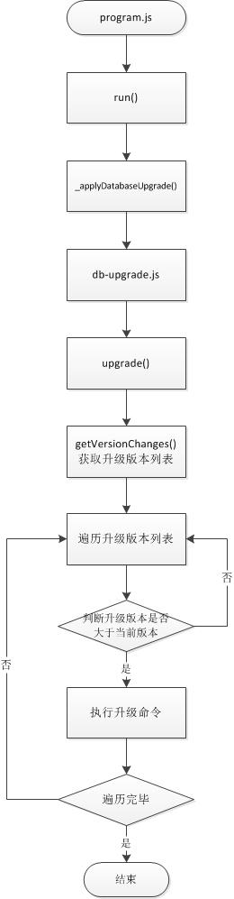

## 1. 数据库配置
&emsp;&emsp;DDN区块链系统支持多种数据库：MySql、SqlServer、Sqlite、Postgres、MariaDB，用户可以根据需要自由选择。<br/>
&emsp;&emsp;数据库相关的参数在config.database.js中进行配置，具体项目和含义如下：
```
exports.dbSettings = {
    connection: {
        host: "127.0.0.1", //数据库IP地址
        dialect: "sqlite", //数据库类型：mysql,postgres,mssql,sqlite
        pool: {
            max: 10,
            min: 1,
            idle: 10000
        },
        // SQLite only
        storage: 'blockchain.db'
    },
    username: "root",   //数据库用户名
    password: "root",   //数据库密码
    database: "ddn"     //数据库名称
}
```

## 2. 模型定义&数据操作
### &emsp;a. 模型定义规范
&emsp;&emsp;一个数据模型定义对应一个js文件，模型定义文件统一放在/src/db/sequelize/models目录中。<br/>
&emsp;&emsp;模型定义文件遵循sequelize规范，内容格式如下：
```
module.exports = (connection) = >{
    //peer即是当前模型定义的名称，全小写，支持26个英文字母、数字和下划线
    return connection.define('peer', {
        //模型属性，全小写，支持26个英文字母、数字和下划线
        ip: {
            //数据类型
            type: Sequelize.INTEGER,
            //是否允许为空
            allowNull: false,
        },
        port: {
            type: Sequelize.INTEGER,
            allowNull: false,
        },
        state: {
            type: Sequelize.INTEGER,
            allowNull: false,
        },
        os: {
            type: Sequelize.STRING(64) 
        },
        version: {
            type: Sequelize.STRING(11)
        },
        clock: {
            type: Sequelize.INTEGER
        },
    },
    {
        //是否自动为模型增加created_at、updated_at字段
        timestamps: false,
        //数据索引定义
        indexes: [{
            //索引是否唯一
            unique: true,
            //索引名称
            name: 'peer_index',
            //索引字段
            fields: ['ip', 'port']
        }]
    });
}
```
[点击查看Sequelize详细文档](https://sequelize.org/v4/)

### &emsp;b. 模型生成流程


### &emsp;c. 运行时对象
&emsp;&emsp;数据库操作对象存在于运行时上下文context中，命名为dao，以context.dao.方法名的格式即可调用对应的数据操作方法。

方法列表：<br/>

```
/**
 * 插入数据
 * @param {*} modelName 模型名称
 * @param {*} modelObj 模型数据
 * @param {*} transaction 事务对象
 * @param {*} cb 回调函数
 */
static insert(modelName, modelObj, transaction, cb)

/**
 * 插入或修改数据
 * @param {*} modelName 模型名称
 * @param {*} modelObj 模型数据
 * @param {*} transaction 事务对象
 * @param {*} cb 回调函数
 */
static insertOrUpdate(modelName, modelObj, transaction, cb)

/**
 * 更新模型数据
 * @param {*} modelName 模型名称
 * @param {*} modelObj 模型数据
 * @param {*} where 更新条件，指定更新范围，参考Sequelize的Query查询定义https://sequelize.readthedocs.io/en/latest/docs/querying/?q=Sequelize.fn&check_keywords=yes&area=default#where
 * @param {*} transaction 事务对象
 * @param {*} cb 回调函数
 */
static update(modelName, modelObj, where, transaction, cb)

/**
 * 系统配置表专用，其他数据禁用，区块链数据不允许删除
 * @param {*} modelName 
 * @param {*} where 查询条件，参考Sequelize的Query查询定义https://sequelize.readthedocs.io/en/latest/docs/querying/?q=Sequelize.fn&check_keywords=yes&area=default#where
 * @param {*} transaction 事务对象
 * @param {*} cb 回调函数
 */
static remove(modelName, where, transaction, cb)

/**
 * 根据主键查询数据
 * @param {*} modelName 模型名称
 * @param {*} value 主键值
 * @param {*} attributes 定义查询返回的字段，默认为全部，具体定义规则参考Sequelize的Query查询参数https://sequelize.readthedocs.io/en/latest/docs/querying/#attributes
 * @param {*} dbTrans 事务对象
 * @param {*} cb 回调函数
 */
static findOneByPrimaryKey(modelName, value, attributes, dbTrans, cb)

/**
 * 列表查询
 * @param {*} modelName 模型名称
 * @param {*} where 查询条件，参考Sequelize的Query查询定义https://sequelize.readthedocs.io/en/latest/docs/querying/?q=Sequelize.fn&check_keywords=yes&area=default#where
 * @param {*} attributes 定义查询返回的字段，默认为全部，参考Sequelize的Query查询参数https://sequelize.readthedocs.io/en/latest/docs/querying/#attributes
 * @param {*} sorts 定义查询的排序方式，参考Sequelize的Query查询参数https://sequelize.readthedocs.io/en/latest/docs/querying/?q=Sequelize.fn&check_keywords=yes&area=default#ordering
 * @param {*} dbTrans 事务对象
 * @param {*} cb 回调函数
 */
static findList(modelName, where, attributes, sorts, dbTrans, cb)

/**
 * 分页查询
 * @param {*} modelName 模型名称
 * @param {*} where 查询条件，参考Sequelize的Query查询定义https://sequelize.readthedocs.io/en/latest/docs/querying/?q=Sequelize.fn&check_keywords=yes&area=default#where
 * @param {*} limit 分页大小
 * @param {*} offset 分页位置
 * @param {*} returnTotal 是否返回记录总数
 * @param {*} attributes 定义查询返回的字段，默认为全部，参考Sequelize的Query查询参数https://sequelize.readthedocs.io/en/latest/docs/querying/#attributes
 * @param {*} sorts 定义查询的排序方式，参考Sequelize的Query查询参数https://sequelize.readthedocs.io/en/latest/docs/querying/?q=Sequelize.fn&check_keywords=yes&area=default#ordering
 * @param {*} dbTrans 事务对象
 * @param {*} cb 回调函数
 */
static findPage(modelName, where, limit, offset, returnTotal, attributes, sorts, dbTrans, cb)

/**
 * 分组
 * @param {*} modelName 模型名称
 * @param {*} where 查询条件，参考Sequelize的Query查询定义https://sequelize.readthedocs.io/en/latest/docs/querying/?q=Sequelize.fn&check_keywords=yes&area=default#where
 * @param {*} limit 分页大小
 * @param {*} offset 分页位置
 * @param {*} group 是否返回记录总数
 * @param {*} attributes 定义查询返回的字段，默认为全部，参考Sequelize的Query查询参数https://sequelize.readthedocs.io/en/latest/docs/querying/#attributes
 * @param {*} orders 定义查询的排序方式，参考Sequelize的Query查询参数https://sequelize.readthedocs.io/en/latest/docs/querying/?q=Sequelize.fn&check_keywords=yes&area=default#ordering
 * @param {*} dbTrans 事务对象
 * @param {*} cb 回调函数
 */
static findListByGroup(modelName, where, options, dbTrans, cb)

/**
 * 根据条件查询到一个对象
 * @param {*} modelName 模型名称
 * @param {*} where 查询条件
 * @param {*} attributes 返回字段
 * @param {*} dbTrans 事务对象
 * @param {*} cb 回调
 */
static findOne(modelName, where, attributes, dbTrans, cb)

/**
 * 根据条件查询到个数
 * @param {*} modelName 模型名称
 * @param {*} where 查询条件
 * @param {*} dbTrans 事务对象
 * @param {*} cb 回调
 */
static count(modelName, where, dbTrans, cb)

/**
 * 执行sql命令
 * @param {*} sql sql语句
 * @param {*} transaction 事务对象
 * @param {*} cb 回调函数
 */
static execSql(sql, transaction, cb)

/**
 * 创建并发起一个事务
 * @param {*} func 业务函数，由用户编写，系统会自动调用，并传入两个参数 trans-事务对象实例，done-回调方法
 * @param {*} cb 回调函数
 */
static transaction(func, cb)

/**
 * 创建指定模型的物理表格
 * @param {*} modelName 模型名称
 * @param {*} force true - 如果存在的话，先删除再创建
 * @param {*} cb 回调函数
 */
static createTable(modelName, force, cb)

/**
 * 删除指定模型的物理表格
 * @param {*} modelName 模型名称
 * @param {*} cb 回调函数
 */
static removeTable(modelName, cb)

/**
 * 清除指定模型的所有数据
 * @param {*} modelName 模型名称
 * @param {*} truncate 使用数据库TRUNCATE方法，释放空间和索引
 * @param {*} cb 回调函数
 */
static clear(modelName, truncate, cb)
```

## 3. 数据升级
&emsp;&emsp;数据升级是系统已经开始运行，已经存在业务数据的情况下，需要对数据库的结构或者数据进行修改的一种机制。<br/>
&emsp;&emsp;数据升级采用版本号和Sql语句升级方式，在db-upgrade.js文件内，将升级语句写在getVersionChanges方法内，系统重启后即可完成数据的升级。<br/><br/>
&emsp;&emsp;升级代码书写如下：<br/>
```
static getVersionChanges() {
    return {
        1: [],
        2: [
            "alter table trs_asset add column strtest varchar(32);"
        ]
    };
}
```
&emsp;&emsp;升级流程<br/>
