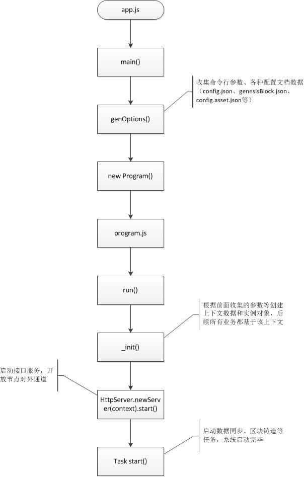
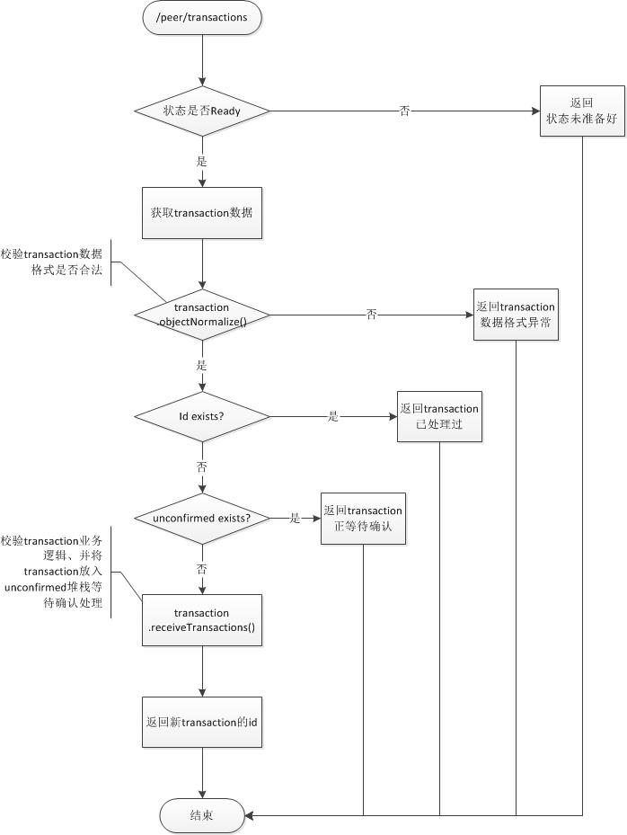
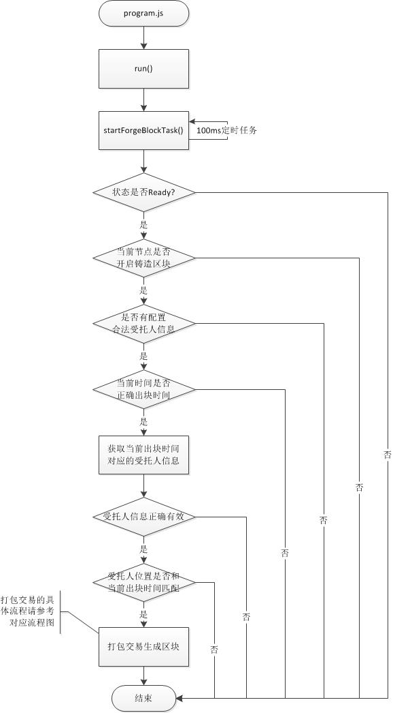
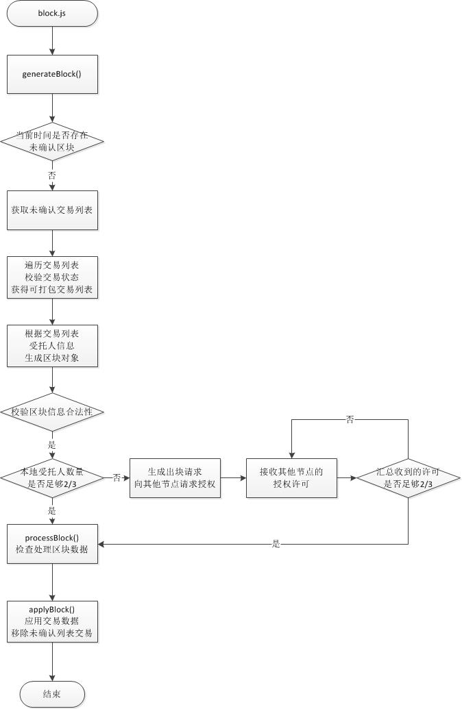
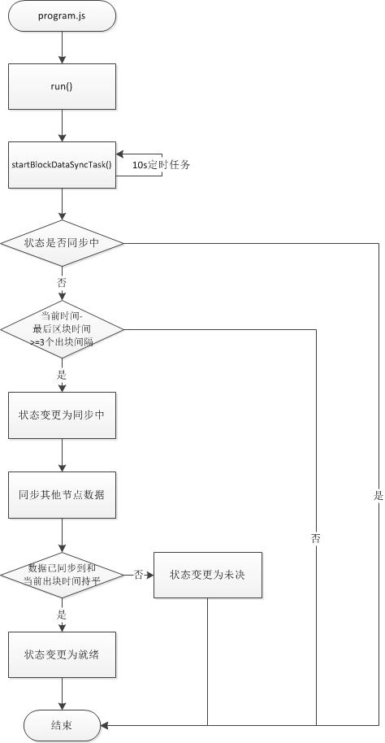

## 1. 源码目录说明

    |-- DDN
        |-- logs    //日志存储目录
        |        
        |-- protos  //protobuf定义文件目录
        |        
        |-- src     //源码目录
        |   |        
        |   |-- assets      //资产目录
        |   |   |
        |   |   |-- system          //系统资产目录
        |   |   |        
        |   |   |-- assets.js       //扩展资产相关操作类
        |   |   |        
        |   |   |-- loader.js       //扩展资产加载类
        |   |        
        |   |-- constants   //Token相关设置文件目录
        |   |        
        |   |-- db          //数据模型和数据操作对象目录
        |   |   |        
        |   |   |-- sequelize       //sequelize相关类目录
        |   |   |   |        
        |   |   |   |-- models              //数据模型定义目录
        |   |   |   |        
        |   |   |   |-- index.js            //常用数据操作类
        |   |   |        
        |   |   |-- database.js     //数据库操作类
        |   |   |        
        |   |   |-- db-params.js    //数据库参数设置类
        |   |   |        
        |   |   |-- db-upgrade.js   //数据库升级类
        |   |
        |   |-- helpers     //帮助类目录
        |   |        
        |   |-- kernal      //核心代码目录
        |   |   |        
        |   |   |-- account         //账户操作类目录
        |   |   |
        |   |   |-- block           //区块操作类目录
        |   |   |
        |   |   |-- lib             //区块链相关算法类目录
        |   |   |
        |   |   |-- peer            //节点操作类目录
        |   |   |
        |   |   |-- transaction     //交易操作类目录
        |   |   |
        |   |   |-- context.js      //运行时上下文类
        |   |   |        
        |   |   |-- program.js      //主程序类
        |   |        
        |   |-- lib         //工具类目录
        |   |        
        |   |-- network     //网络服务目录
        |   |   |        
        |   |   |-- middleware      //中间件目录
        |   |   |        
        |   |   |-- service         //对外接口目录
        |   |   |   |        
        |   |   |   |-- api         //Api接口
        |   |   |   |        
        |   |   |   |-- peer        //节点接口
        |   |   |        
        |   |   |-- socketio        //websocket服务类目录
        |   |   |
        |   |   |-- http-server.js  //Http服务类
        |   |   |        
        |   |   |-- peer-invoker.js //节点服务调用类
        |   |        
        |   |-- schema      //数据校验类目录
        |   |   |        
        |   |   |-- ddn-schemas     //DDN常用数据格式定义目录
        |   |   |        
        |   |   |-- format-ext      //数据格式扩展规范目录
        |   |   |        
        |   |   |-- ddn-schema.js   //数据格式校验操作类
        |   |
        |   |-- logger.js   //日志类
        |
        |-- test    //测试案例目录
        |        
        |-- app.js  //系统入口文件
        |        
        |-- config.asset.js     //扩展资产配置文件
        |        
        |-- config.database.js  //数据库配置文件
        |        
        |-- config.json         //系统参数配置文件
        |        
        |-- genesisBlock.json   //创世区块数据文件

## 2. 系统架构

## 3. DDN核心流程

### &emsp;a. 系统启动流程

### &emsp;b. 新交易流程

### &emsp;c. 区块铸造流程

### &emsp;d. 交易打包流程

### &emsp;e. 节点同步流程
